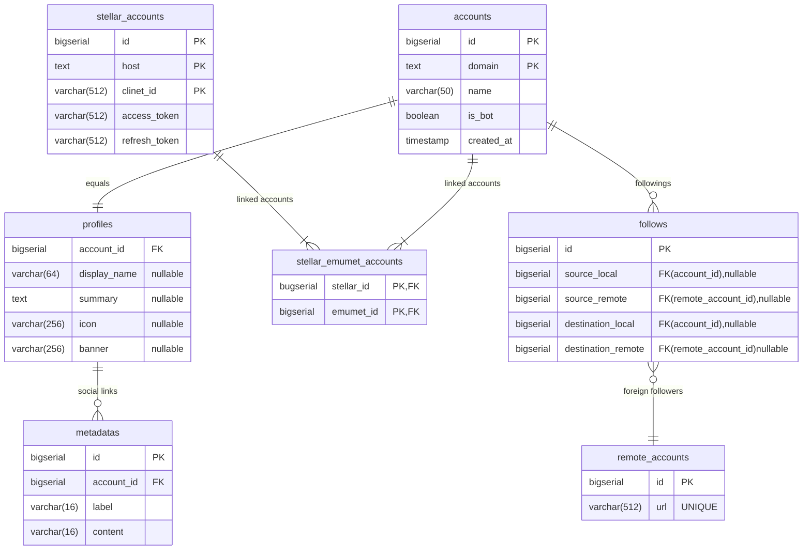

# DataStructure

## Account

```mermaid
erDiagram
accounts {
	bigserial id "PK"
	text domain "PK"
	varchar(50) name
	boolean is_bot
	timestamp created_at
}
profiles {
	bigserial account_id "FK"
	varchar(64) display_name "nullable"
	text summary "nullable"
 	varchar(256) icon "nullable"
	varchar(256) banner "nullable"
}
metadatas {
	bigserial id "PK"
	bigserial account_id "FK"
	varchar(16) label
	varchar(16) content
}
stellar_accounts {
	bigserial id "PK"
	text host "PK"
	varchar(512) clinet_id "PK"
	varchar(512) access_token
	varchar(512) refresh_token
}
stellar_emumet_accounts {
	bugserial stellar_id "PK,FK"
	bigserial emumet_id "PK,FK"
}
follows {
	bigserial id "PK"
	bigserial source_local "FK(account_id),nullable"
	bigserial source_remote "FK(remote_account_id),nullable"
	
	bigserial destination_local "FK(account_id),nullable"
	bigserial destination_remote "FK(remote_account_id)nullable"
}

remote_accounts {
	bigserial id "PK"
	varchar(512) url "UNIQUE"
}

accounts ||--|| profiles : "equals"
stellar_accounts ||--|{ stellar_emumet_accounts : "linked accounts"
accounts ||--|{ stellar_emumet_accounts : "linked accounts"
profiles ||--o{ metadatas : "social links"
accounts ||--o{ follows : "followings"
follows }o--|| remote_accounts : "foreign followers"
```
