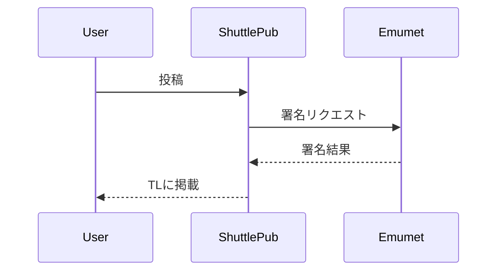
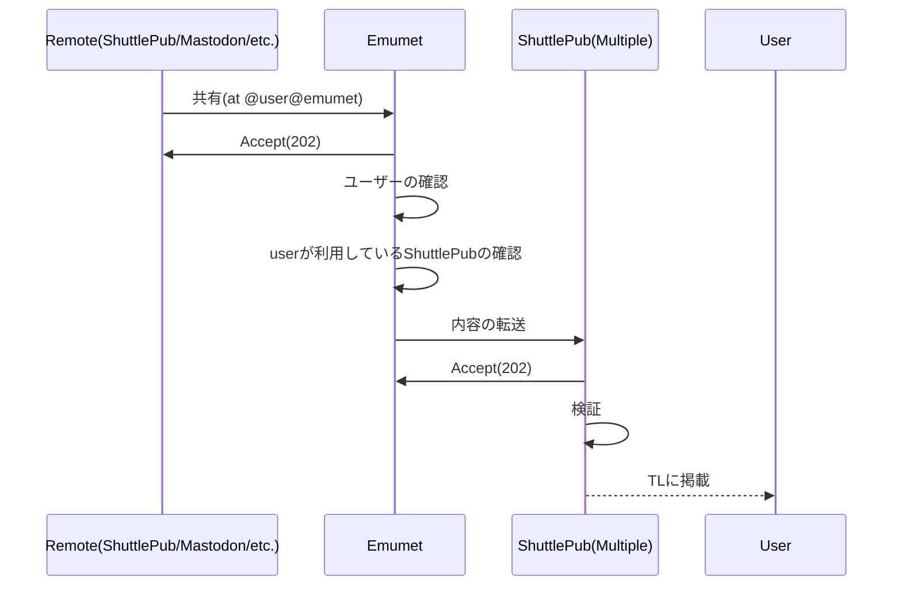

# 一般的な処理のフロー

## 投稿の署名

```mermaid
sequenceDiagram
    participant A as User
    participant P as ShuttlePub
    participant S as Emumet
    A->>P: 投稿
    P->>S: 署名リクエスト
    S-->>P: 署名結果
    P-->>A: TLに掲載
```

### 他者の投稿の処理

投稿内容についてはShuttlePub側で処理する

```mermaid
sequenceDiagram
    participant R as Remote(ShuttlePub/Mastodon/etc.)
    participant S as Emumet
    participant P as ShuttlePub(Multiple)
    participant A as User
    R->>S: 共有(at @user@emumet)
    S->>R: Accept(202)
    S->>S: ユーザーの確認
    S->>S: userが利用しているShuttlePubの確認
    S->>P: 内容の転送
    P->>S: Accept(202)
    P->>P: 検証
    P-->>A: TLに掲載
```
