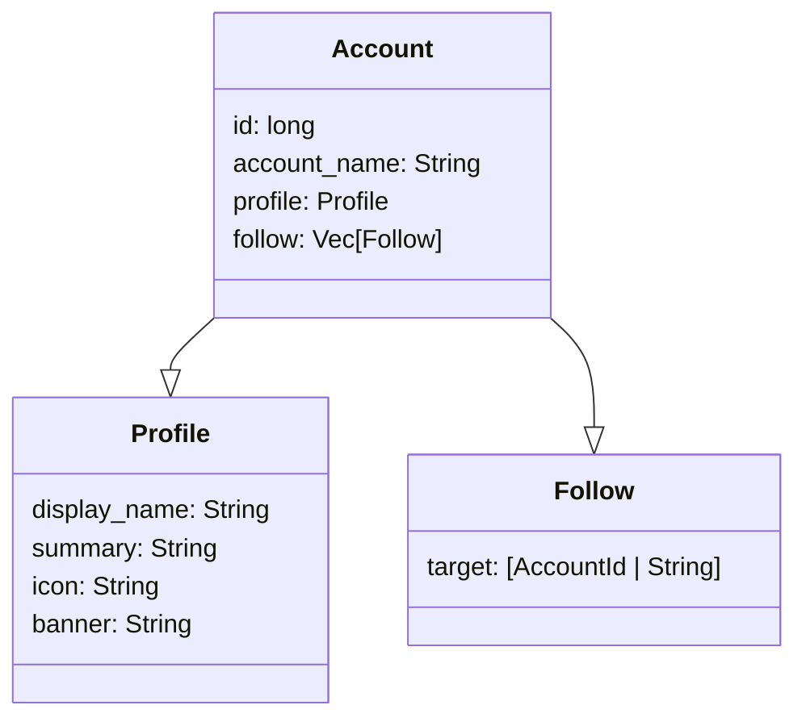

# DataStructure

```mermaid
classDiagram
	class Account {
		id: long
		account_name: String
		profile: Profile
		follow: Vec[Follow]
	}
	class Profile {
		display_name: String
		summary: String
		icon: String
		banner: String
	}
	class Follow {
		target: [AccountId | String]
	}
	Account --|> Profile
	Account --|> Follow
```
