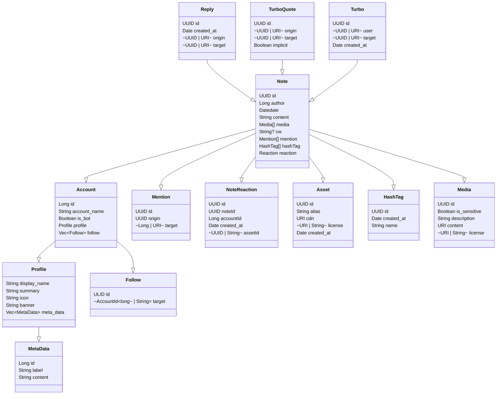

# DataStructure

```mermaid
classDiagram
	class Account {
		Long id
		String account_name
		Boolean is_bot
		Profile profile
		Vec~Follow~ follow
	}
	class Profile {
		String display_name
		String summary
		String icon
		String banner
		Vec~MetaData~ meta_data
	}
	class Follow {
		ULID id
		~AccountId~long~ | String~ target
	}
	class MetaData {
		Long id
		String label
		String content
	}
	Account --|> Profile
	Account --|> Follow
	Profile --|> MetaData
	
	
class Note {
	UUID id
	Long author
	Datedate
	String content
	Media[] media
	String? cw
	Mention[] mention
	HashTag[] hashTag
	Reaction reaction
}
class Mention {
	UUID id
	UUID origin
	~Long | URI~ target
}
class NoteReaction {
	UUID id
	UUID noteId
	Long accountId
	Date created_at
	~UUID | String~ assetId
}
class Asset {
	UUID id
	String alias
	URI cdn
	~URI | String~ license
	Date created_at
}
class HashTag {
	UUID id
	Date created_at
	String name
}
class Reply {
	UUID id
	Date created_at
	~UUID | URI~ origin
	~UUID | URI~ target
}
class TurboQuote {
	UUID id
	~UUID | URI~ origin
	~UUID | URI~ target
	Boolean implicit
}
class Turbo {
	UUID id
	~UUID | URI~ user
	~UUID | URI~ target
	Date created_at
}
class Media {
	UUID id
	Boolean is_sensitive
	String description
	URI content
	~URI | String~ license
}
Note--|>NoteReaction
Note--|>Mention
Note--|>Asset
Note--|>HashTag
Reply--|>Note
TurboQuote--|>Note
Turbo--|>Note
Note--|>Media

Note--|>Account
```
