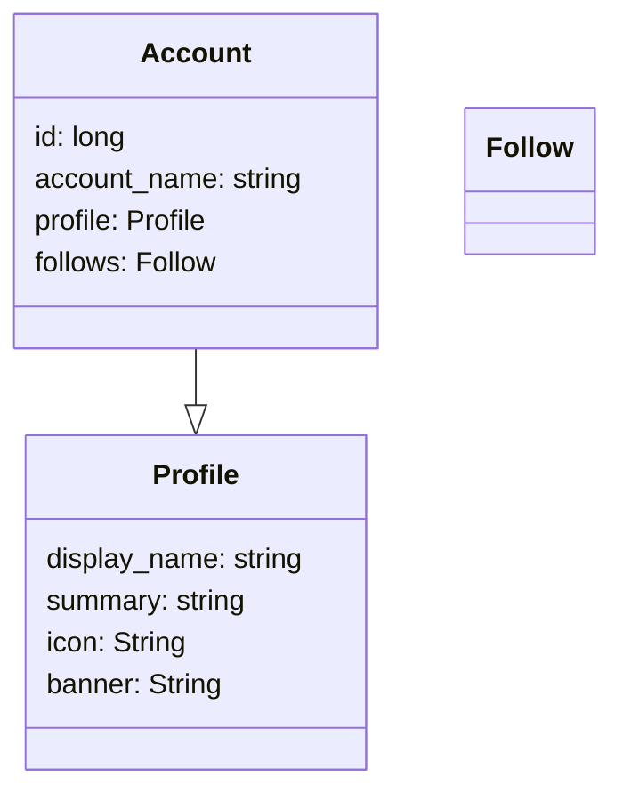

# DataStructure

```mermaid
classDiagram
	class Account {
		id: long
		account_name: string
		profile: Profile
		follows: Follow
	}
	class Profile {
		display_name: string
		summary: string
		icon: String
		banner: String
	}
	class Follow {
		
	}
	Account --|> Profile
```
