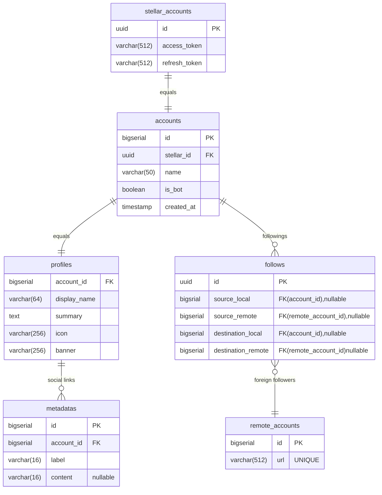
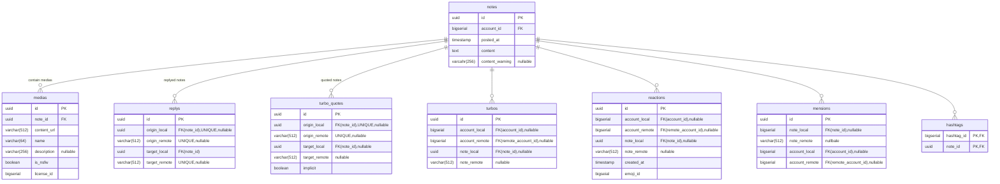

# DataStructure

## Account

```mermaid
erDiagram
accounts {
	bigserial id "PK"
	uuid stellar_id "FK"
	varchar(50) name
	boolean is_bot
	timestamp created_at
}
profiles {
	bigserial account_id "FK"
	varchar(64) display_name
	text summary
 	varchar(256) icon
	varchar(256) banner
}
metadatas {
	bigserial id "PK"
	bigserial account_id "FK"
	varchar(16) label
	varchar(16) content "nullable"
}
stellar_accounts {
	uuid id "PK"
	varchar(512) access_token
	varchar(512) refresh_token
}
follows {
	uuid id "PK"
	bigsrial source_local "FK(account_id),nullable"
	bigserial source_remote "FK(remote_account_id),nullable"
	
	bigserial destination_local "FK(account_id),nullable"
	bigserial destination_remote "FK(remote_account_id)nullable"
}

remote_accounts {
	bigserial id "PK"
	varchar(512) url "UNIQUE"
}

accounts ||--|| profiles : "equals"
stellar_accounts ||--|| accounts : "equals"
profiles ||--o{ metadatas : "social links"
accounts ||--o{ follows : "followings"
follows }o--|| remote_accounts : "foreign followers"
```

## Note

```mermaid
erDiagram
notes {
	uuid id "PK"
	bigserial account_id "FK"
	timestamp posted_at
	text content
	varcahr(256) content_warning "nullable"
}
medias {
	uuid id "PK"
	uuid note_id "FK"
	varchar(512) content_url
	varchar(64) name
	varchar(256) description "nullable"
	boolean is_nsfw
	bigserial license_id
}
replys {
	uuid id "PK"
	uuid origin_local "FK(note_id),UNIQUE,nullable"
	varchar(512) origin_remote "UNIQUE,nullable"
	
	uuid target_local "FK(note_id)"
	varchar(512) target_remote "UNIQUE,nullable"
}
turbo_quotes {
	uuid id "PK"
	uuid origin_local "FK(note_id),UNIQUE,nullable"
	varchar(512) origin_remote "UNIQUE,nullable"
	
	uuid target_local "FK(note_id),nullable"
	varchar(512) target_remote "nullable"
	boolean implicit
}
turbos {
	uuid id "PK"
	bigseial account_local "FK(account_id),nullable"
	bigserial account_remote "FK(remote_account_id),nullable"
	
	uuid note_local "FK(note_id),nullable"
	varchar(512) note_remote "nullable"
}
reactions {
	uuid id "PK"
	bigserial account_local "FK(account_id),nullable"
	bigserial account_remote "FK(remote_account_id),nullable"
	
	uuid note_local "FK(note_id),nullable"
	varchar(512) note_remote "nullable"
	timestamp created_at
	bigseial emoji_id
}
mensions {
	uuid id "PK"
	bigserial note_local "FK(note_id),nullable"
	varchar(512) note_remote "nullbale"
	
	bigserial account_local "FK(account_id),nullable"
	bigserial account_remote "FK(remote_account_id),nullable"
}
hashtags {
	bigserial hashtag_id "PK,FK"
	uuid note_id "PK,FK"
}

notes ||--o{ medias : "contain medias"
notes ||--o{ replys : "replyed notes"
notes ||--o{ turbo_quotes : "quoted notes"
notes ||--o{ turbos : ""
notes ||--o{ reactions : ""
notes ||--o{ mensions : ""
notes ||--o{ hashtags : ""
```

