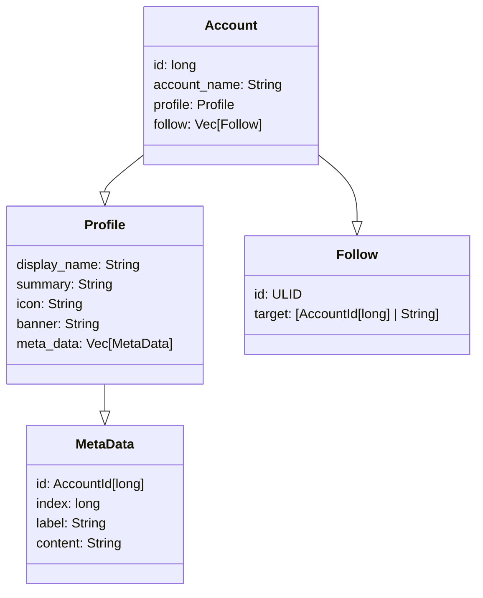

# DataStructure

```mermaid
classDiagram
	class Account {
		id: long
		account_name: String
		profile: Profile
		follow: Vec[Follow]
	}
	class Profile {
		display_name: String
		summary: String
		icon: String
		banner: String
		meta_data: Vec[MetaData]
	}
	class Follow {
		id: ULID
		target: [AccountId[long] | String]
	}
	class MetaData {
		id: AccountId[long]
		index: long
		label: String
		content: String
	}
	Account --|> Profile
	Account --|> Follow
	Profile --|> MetaData
```
