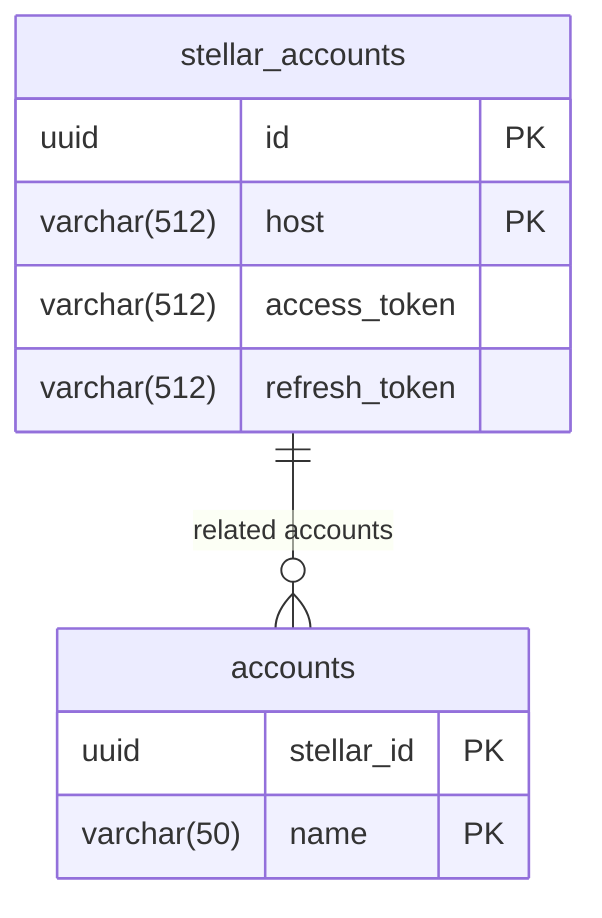
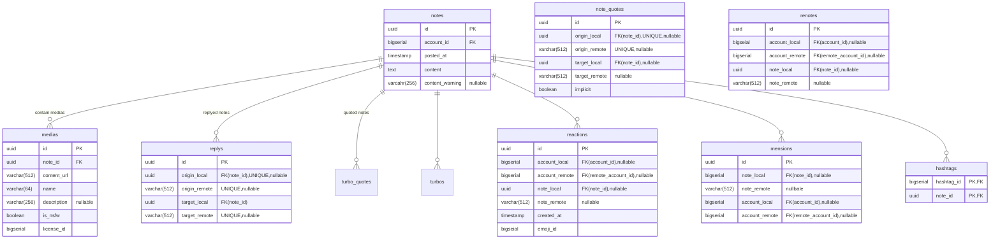

# DataStructure

## Account

```mermaid
erDiagram
stellar_accounts {
	uuid id "PK"
	varchar(512) host "PK"
	varchar(512) access_token
	varchar(512) refresh_token
}
accounts {
	uuid stellar_id "PK" 
	varchar(50) name "PK"
}
stellar_accounts ||--o{ accounts : "related accounts"
```

## Note

```mermaid
erDiagram
notes {
	uuid id "PK"
	bigserial account_id "FK"
	timestamp posted_at
	text content
	varcahr(256) content_warning "nullable"
}
medias {
	uuid id "PK"
	uuid note_id "FK"
	varchar(512) content_url
	varchar(64) name
	varchar(256) description "nullable"
	boolean is_nsfw
	bigserial license_id
}
replys {
	uuid id "PK"
	uuid origin_local "FK(note_id),UNIQUE,nullable"
	varchar(512) origin_remote "UNIQUE,nullable"
	
	uuid target_local "FK(note_id)"
	varchar(512) target_remote "UNIQUE,nullable"
}
note_quotes {
	uuid id "PK"
	uuid origin_local "FK(note_id),UNIQUE,nullable"
	varchar(512) origin_remote "UNIQUE,nullable"
	
	uuid target_local "FK(note_id),nullable"
	varchar(512) target_remote "nullable"
	boolean implicit
}
renotes {
	uuid id "PK"
	bigseial account_local "FK(account_id),nullable"
	bigserial account_remote "FK(remote_account_id),nullable"
	
	uuid note_local "FK(note_id),nullable"
	varchar(512) note_remote "nullable"
}
reactions {
	uuid id "PK"
	bigserial account_local "FK(account_id),nullable"
	bigserial account_remote "FK(remote_account_id),nullable"
	
	uuid note_local "FK(note_id),nullable"
	varchar(512) note_remote "nullable"
	timestamp created_at
	bigseial emoji_id
}
mensions {
	uuid id "PK"
	bigserial note_local "FK(note_id),nullable"
	varchar(512) note_remote "nullbale"
	
	bigserial account_local "FK(account_id),nullable"
	bigserial account_remote "FK(remote_account_id),nullable"
}
hashtags {
	bigserial hashtag_id "PK,FK"
	uuid note_id "PK,FK"
}

notes ||--o{ medias : "contain medias"
notes ||--o{ replys : "replyed notes"
notes ||--o{ turbo_quotes : "quoted notes"
notes ||--o{ turbos : ""
notes ||--o{ reactions : ""
notes ||--o{ mensions : ""
notes ||--o{ hashtags : ""
```

