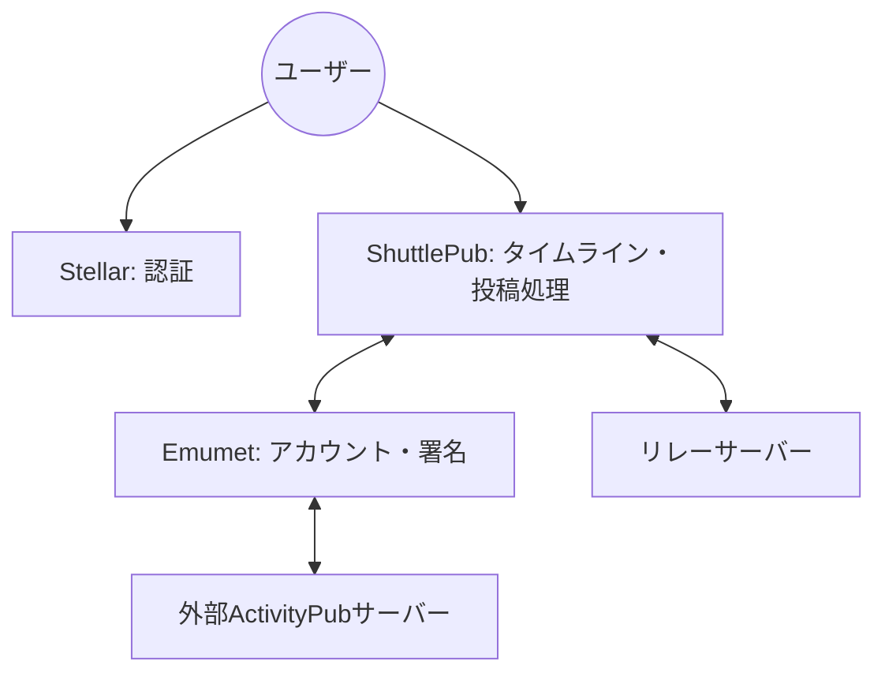

# ShuttlePub システムパターン

## システムアーキテクチャ

ShuttlePubシステムは以下のコンポーネントから構成される分散アーキテクチャを採用：



## 主要技術決定

- **コンポーネント分離**: 機能ごとに独立したサービスとして実装
- **ActivityPub準拠**: W3C標準のActivityPubプロトコルに完全準拠
- **署名検証**: セキュリティ確保のための暗号署名検証の実装

## 設計パターン

### 投稿処理フロー

1. **外部からの投稿処理**
   ```mermaid
   flowchart LR
       External --> Emumet --> ShuttlePub --> Timeline
   ```

2. **ShuttlePubからの投稿処理**
   ```mermaid
   flowchart LR
       ShuttlePub --> Emumet
       Emumet --> External
       Emumet --> ShuttlePub
       ShuttlePub --> Timeline
       ShuttlePub --> Relay
   ```

3. **リレーサーバーからの投稿処理**
   ```mermaid
   flowchart LR
       Relay --> ShuttlePub --> GlobalTimeline
   ```

### コンポーネント関係

- **Emumet**: ActivityPubアカウント管理と外部通信の専門家
- **ShuttlePub**: タイムライン管理と投稿処理の専門家
- **Stellar**: ユーザー認証と権限管理の専門家

## データフロー

投稿データは以下のパスで流れる：

1. ユーザー作成投稿: ShuttlePub → Emumet（署名） → 外部サーバー + ShuttlePub（表示）
2. 外部からの投稿: 外部サーバー → Emumet → ShuttlePub（検証・表示）
3. リレー投稿: リレーサーバー → ShuttlePub（検証・表示）