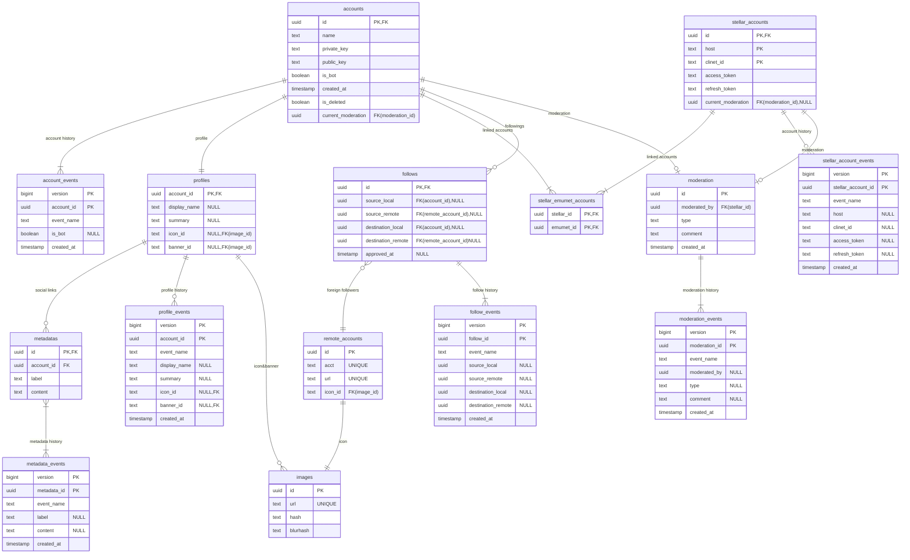

# DataStructure

## Account

```mermaid
erDiagram
    accounts {
        uuid id "PK,FK"
        text name
        text private_key
        text public_key
        boolean is_bot
        timestamp created_at
        boolean is_deleted
        uuid current_moderation "FK(moderation_id)"
    }
    account_events {
        bigint version "PK"
        uuid account_id "PK"
        text event_name
        boolean is_bot "NULL"
        timestamp created_at
    }
    profiles {
        uuid account_id "PK,FK"
        text display_name "NULL"
        text summary "NULL"
        text icon_id "NULL,FK(image_id)"
        text banner_id "NULL,FK(image_id)"
    }
    profile_events {
        bigint version "PK"
        uuid account_id "PK"
        text event_name
        text display_name "NULL"
        text summary "NULL"
        text icon_id "NULL,FK"
        text banner_id "NULL,FK"
        timestamp created_at
    }
    metadatas {
        uuid id "PK,FK"
        uuid account_id "FK"
        text label
        text content
    }
    metadata_events {
        bigint version "PK"
        uuid metadata_id "PK"
        text event_name
        text label "NULL"
        text content "NULL"
        timestamp created_at
    }
    stellar_accounts {
        uuid id "PK,FK"
        text host "PK"
        text clinet_id "PK"
        text access_token
        text refresh_token
        uuid current_moderation "FK(moderation_id),NULL"
    }
    stellar_account_events {
        bigint version "PK"
        uuid stellar_account_id "PK"
        text event_name
        text host "NULL"
        text clinet_id "NULL"
        text access_token "NULL"
        text refresh_token "NULL"
        timestamp created_at
    }
    stellar_emumet_accounts {
        uuid stellar_id "PK,FK"
        uuid emumet_id "PK,FK"
    }
    follows {
        uuid id "PK,FK"
        uuid source_local "FK(account_id),NULL"
        uuid source_remote "FK(remote_account_id),NULL"
        uuid destination_local "FK(account_id),NULL"
        uuid destination_remote "FK(remote_account_id)NULL"
        timetamp approved_at "NULL"
    }
    follow_events {
        bigint version "PK"
        uuid follow_id "PK"
        text event_name
        uuid source_local "NULL"
        uuid source_remote "NULL"
        uuid destination_local "NULL"
        uuid destination_remote "NULL"
        timestamp created_at
    }
    remote_accounts {
        uuid id "PK"
        text acct "UNIQUE"
        text url "UNIQUE"
        text icon_id "FK(image_id)"
    }
    images {
        uuid id "PK"
        text url "UNIQUE"
        text hash
        text blurhash
    }
    moderation {
        uuid id "PK"
        uuid moderated_by "FK(stellar_id)"
        text type
        text comment
        timestamp created_at
    }
    moderation_events {
        bigint version "PK"
        uuid moderation_id "PK"
        text event_name
        uuid moderated_by "NULL"
        text type "NULL"
        text comment "NULL"
        timestamp created_at
    }

    accounts ||--|{ account_events: "account history"
    accounts ||--|| profiles: "profile"
    stellar_accounts ||--|{ stellar_emumet_accounts: "linked accounts"
    stellar_accounts ||--o{ stellar_account_events: "account history"
    accounts ||--|{ stellar_emumet_accounts: "linked accounts"
    metadatas }|--|{ metadata_events: "metadata history"
    profiles ||--o{ metadatas: "social links"
    profiles ||--o{ profile_events: "profile history"
    accounts ||--o{ follows: "followings"
    follows }o--|| remote_accounts: "foreign followers"
    follows ||--|{ follow_events: "follow history"
    profiles ||--o{ images: "icon&banner"
    remote_accounts ||--|| images: "icon"
    accounts ||--o| moderation: "moderation"
    stellar_accounts ||--o| moderation: "moderation"
    moderation ||--|{ moderation_events: "moderation history"
```
