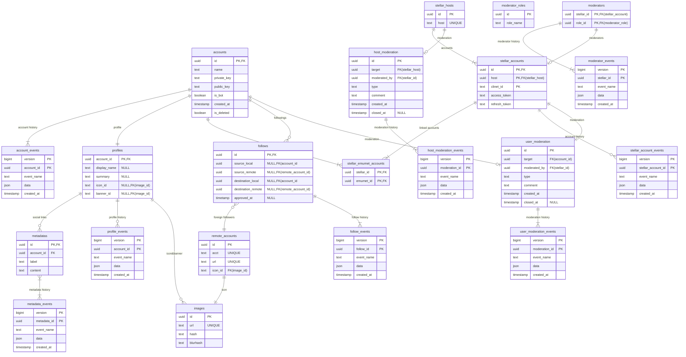

# DataStructure

## DatabaseOverview

## Events

### Account

- account_created
  - name: `text`
  - private_key: `text`
  - public_key: `text`
  - is_bot: `boolean`
- account_updated
  - is_bot: `boolean`
- account_deleted

### Profile

- profile_created
  - display_name: `text`
  - summary: `text`
  - icon_id: `text`
  - banner_id: `text`
- profile_updated
  - display_name?: `text`
  - summary?: `text`
  - icon_id?: `text`
  - banner_id?: `text`
- profile_deleted

### Metadata

- metadata_created
  - label: `text`
  - content: `text`
- metadata_updated
  - label?: `text`
  - content?: `text`
- metadata_deleted

### StellarAccount

- stellar_account_created
  - host: `text`
  - client_id: `text`
  - access_token: `text`
  - refresh_token: `text`
- stellar_account_updated
  - host?: `text`
  - client_id?: `text`
  - access_token?: `text`
  - refresh_token?: `text`
- stellar_account_deleted

### Follow

- follow_requested
  - source_local?: `uuid`
  - source_remote?: `uuid`
  - destination_local?: `uuid`
  - destination_remote?: `uuid`
- follow_accepted
  - source_local?: `uuid`
  - source_remote?: `uuid`
  - destination_local?: `uuid`
  - destination_remote?: `uuid`
- follow_rejected
  - source_local?: `uuid`
  - source_remote?: `uuid`
  - destination_local?: `uuid`
  - destination_remote?: `uuid`

### Moderator

- role_created
  - role_name: `text`
- role_updated
  - role_name: `text`
  - role_deleted
- moderator_assigned
  - role_name: `text`
  - account_id: `uuid`
- moderator_unassigned
  - role_name: `text`
  - account_id: `uuid`

### HostModeration

- hostModeration_created
  - target: `uuid`
  - moderated_by: `uuid`
  - type: `text`
  - comment: `text`
- host_moderation_updated
  - target?: `uuid`
  - moderated_by?: `uuid`
  - type?: `text`
  - comment?: `text`
- host_moderation_closed

### UserModeration

- user_moderation_created
  - target: `uuid`
  - moderated_by: `uuid`
  - type: `text`
  - comment: `text`
- user_moderation_updated
  - target?: `uuid`
  - moderated_by?: `uuid`
  - type?: `text`
  - comment?: `text`
- user_moderation_closed