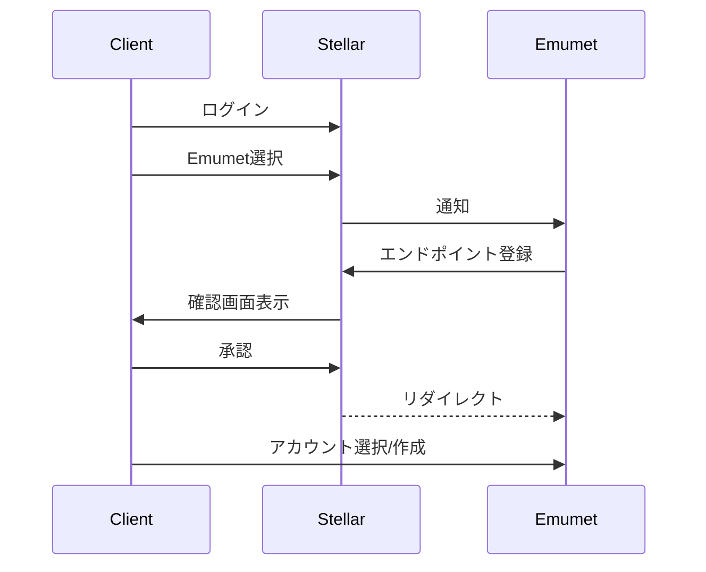
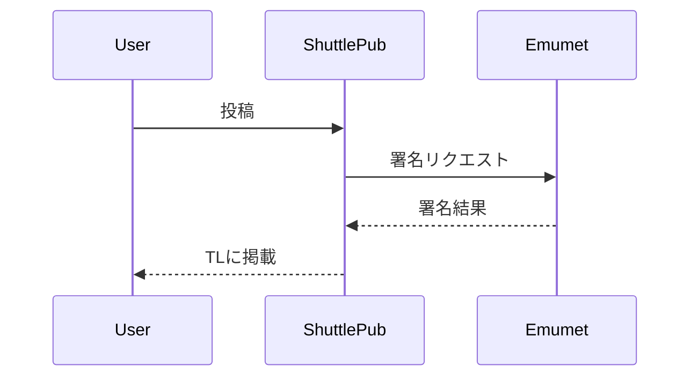
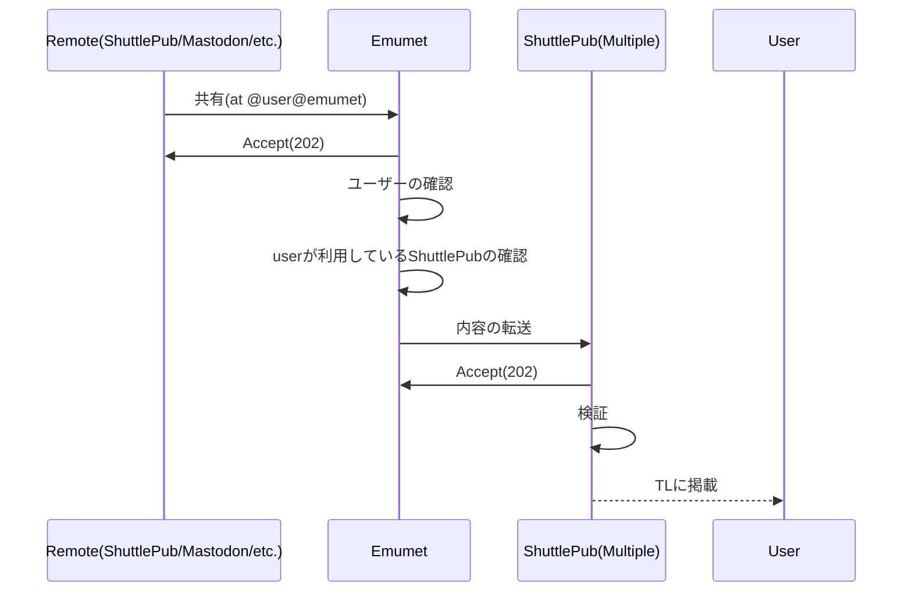
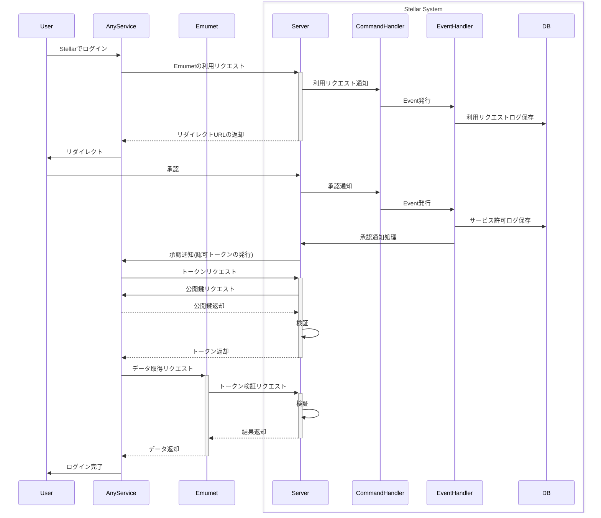

# 一般的な処理のフロー

## Stellarアカウントを元にEmumetへログインしてアカウントを選択する

## 投稿の署名

### 他者の投稿の処理

投稿内容についてはShuttlePub側で処理する

### 他サービスでのEmumetデータ利用(新規)

> クライアント認証方式は`private_key_jwt`のみを想定

->> Request  
-->> Response  
