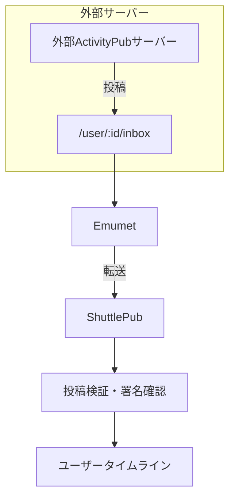
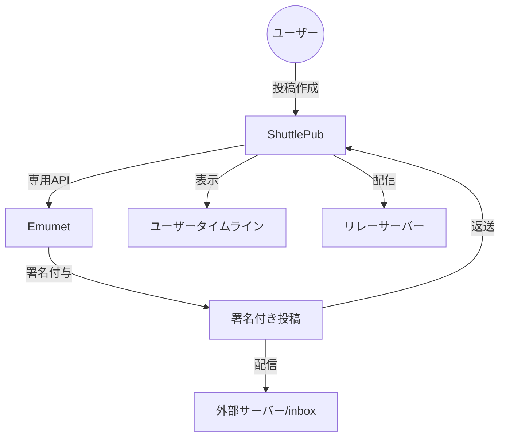
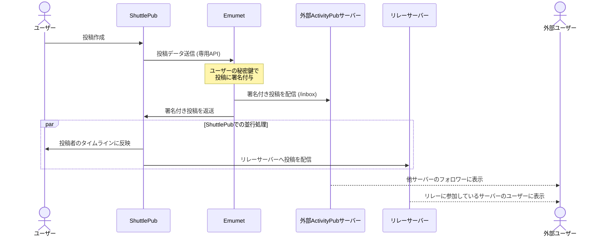
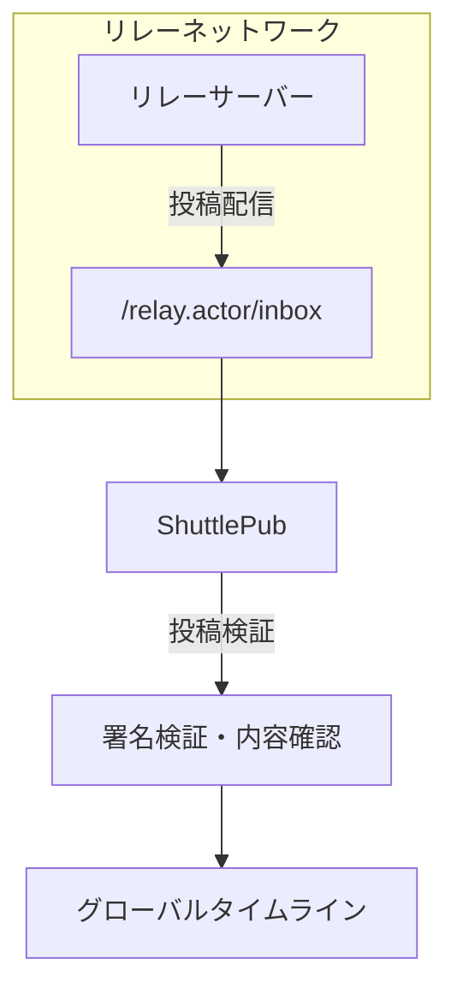

# 投稿処理フロー

1. 外部（Emumet）からの投稿処理
2. ShuttlePubからの投稿処理
3. リレーサーバーからの投稿処理

## EmumetとShuttlePubの役割

各コンポーネントの詳細な役割については、以下のドキュメントを参照：
- [Emumetの機能と役割](../emumet/features.md)
- [ShuttlePubの機能と役割](../shuttlepub/features.mdx)

## 外部からの投稿処理

### フロー概要図

外部サーバーからの投稿フローでは：
1. 外部ユーザーが外部ActivityPubサーバー（MastodonやPleromaなど）で投稿を作成
2. 外部サーバーからの投稿がEmumetに所属する対象ユーザーの`/user/:id/inbox`エンドポイントに到達
3. Emumetが関連するShuttlePubサーバーに投稿を転送
4. ShuttlePubにて投稿の検証と署名確認を実施
5. 検証された投稿内容がShuttlePubのユーザータイムラインに表示

このフローでは、EmumetがProxyのような振舞いをし、外部からの投稿をShuttlePubに適切に橋渡し。

## ShuttlePubからの投稿処理

ShuttlePubプラットフォーム内で作成された投稿の処理フロー。

### フロー概要図

### 時系列シーケンス図

ShuttlePubからの投稿フローでは：
1. ユーザーがShuttlePubから投稿を作成
2. 投稿データがEmumetに送信（専用APIを使用）
3. Emumetがユーザーの秘密鍵を使用して投稿に署名を付与
4. 署名付き投稿が直接外部のActivityPubサーバーのinboxと投稿したShuttlePubに配信
5. ShuttlePubは以下の処理を並行して実行：
   - ユーザーのタイムラインに表示
   - リレーサーバーへの配信

このフローでは、Emumetが投稿の署名と外部サーバーへの配信を担当し、ShuttlePubはタイムライン表示とリレーサーバー配信を担当。

#### エラー処理とエッジケース

- **署名失敗**: Emumetでの署名処理が失敗した場合、エラーメッセージがShuttlePubに返され、ユーザーに通知
- **外部サーバー到達不能**: 外部サーバーが応答しない場合、Emumetはバックグラウンドでリトライを実行
- **リレーサーバー配信失敗**: リレーサーバーへの配信が失敗した場合、ShuttlePubはバックグラウンドでリトライを実行

## リレーサーバーからの投稿処理

リレーサーバーを経由して届いた投稿の処理フロー。

リレーサーバーからの投稿フローでは：
1. リレーサーバーから投稿データがShuttlePubの`/relay.actor/inbox`エンドポイントに到達
2. ShuttlePubは投稿の署名検証と内容確認を実施
3. 検証された投稿はグローバルタイムライン（GTL）に表示

`relay.actor`は特殊なActivityPubユーザーとして機能し、リレーサーバーとの通信を専門に担当。

## 投稿処理の比較

3つの投稿処理フローの主な違いは以下の通り：

| 処理タイプ | 開始点 | Emumetの役割 | ShuttlePubの役割 | 最終出力 |
|------------|--------|--------------|------------------|----------|
| **外部からの投稿** | 外部ActivityPubサーバー | 投稿の転送 | 投稿検証・タイムライン形成 | ユーザータイムライン |
| **ShuttlePubからの投稿** | ShuttlePubユーザー | 署名付与・外部配信 | タイムライン表示・リレー配信 | ユーザータイムライン・外部サーバー |
| **リレーサーバーからの投稿** | リレーサーバー | 関与なし | 受信・検証・表示 | グローバルタイムライン |

## inbox/outboxの役割

ActivityPubプロトコルにおけるinboxとoutboxの役割は以下の通り：

- **inbox**: 外部から投稿を受け取るためのエンドポイント。各ユーザーやrelay.actorが持ち、外部からのActivityPubメッセージを受信。
- **outbox**: ユーザーが投稿した内容を公開するためのエンドポイント。主にユーザーの発信内容を外部に公開するために使用。relay.actorの場合は他システムとの互換性のために存在。